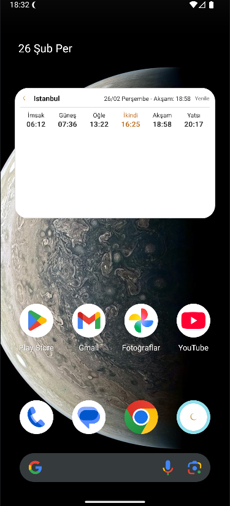
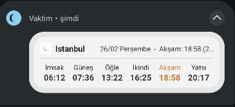
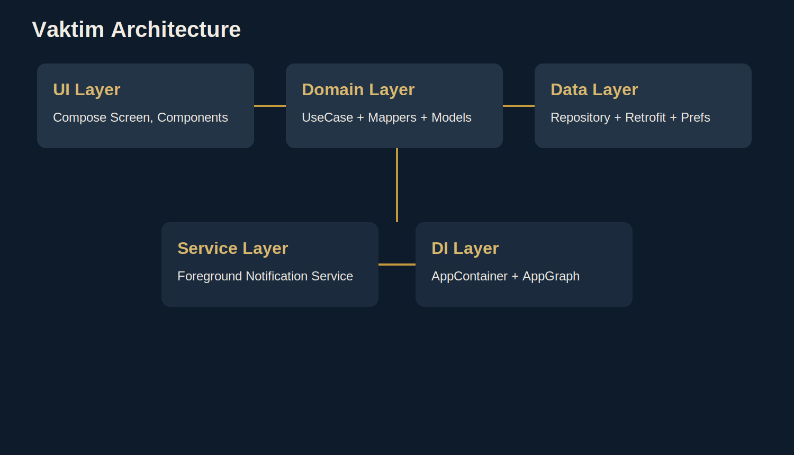

# Vaktim

Vaktim, namaz vakitlerini gosteren, sonraki vakti hesaplayan ve bildirim cubugunda surekli gorunur servis ile vakit takibi yapan Android uygulamasidir.

## Ozellikler

- Sehir/ulke/ilce bazli namaz vakti sorgulama
- Sonraki vakit ve kalan sure hesaplama
- Foreground service ile bildirim panelinde vakit gosterimi
- Ana ekrana eklenebilen namaz vakti widget'i
- Gunluk ayet/meal cekme
- SOLID odakli katmanli mimari (UI / Domain / Data / Service / DI)

## Proje Gorselleri

### Ana Ekran + Widget (Guncel)



### Bildirim Gorunumu (Guncel)


### Bildirim Paneli (Guncel)



### Mimari Diyagram



## APK Indirme

APK dosyalari repository icine eklenmez. Indirme icin GitHub Releases kullanilir.

- Releases sayfasi: `https://github.com/<owner>/<repo>/releases`
- Tek APK link formati: `https://github.com/<owner>/<repo>/releases/latest/download/vaktim-1.0.apk`

## Teknoloji Yigini

- Kotlin
- Jetpack Compose + Material 3
- ViewModel + StateFlow
- Retrofit + OkHttp + Gson
- Foreground Service + Notification RemoteViews

## Mimari Klasor Yapisi

```text
app/src/main/java/com/project/vaktim
|-- core
|-- data
|   |-- api
|   |-- local
|   |-- model
|   `-- repository
|-- di
|-- domain
|-- service
`-- ui
```

## Lokalde Derleme

```bash
./gradlew assembleDebug
./gradlew testDebugUnitTest
./gradlew lintDebug
```

Windows:

```powershell
.\gradlew.bat assembleDebug
.\gradlew.bat testDebugUnitTest
.\gradlew.bat lintDebug
```

## APK Yayin Akisi

Yeni release APK olusturduktan sonra tek dosya olarak `vaktim-1.0.4.apk` adiyla GitHub Release asset'e yukleyin:

```powershell
.\gradlew.bat assembleRelease
& "C:\Users\<kullanici>\AppData\Local\Android\Sdk\build-tools\36.1.0\apksigner.bat" sign `
  --ks "C:\Users\<kullanici>\.android\debug.keystore" `
  --ks-key-alias androiddebugkey `
  --ks-pass pass:android `
  --key-pass pass:android `
  --out releases\vaktim-1.0.4.apk `
  app\build\outputs\apk\release\app-release-unsigned.apk
```
